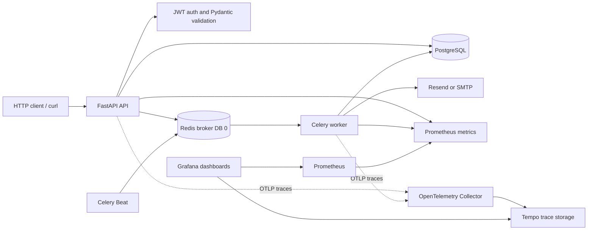

# TempoSort Backend Engineering Debrief

**Purpose:** A factual project narrative for a resume, portfolio, or technical interview. This documents what exists and has been exercised locally; it does not imply the service has been deployed to production.

## Executive Summary

TempoSort is a versioned FastAPI backend for authenticated task management, email verification, and scheduled reminders. The project evolved from an existing API into a local, production-oriented engineering stack: async SQLAlchemy/PostgreSQL persistence, Alembic migrations, Redis-backed Celery workers, retry and idempotency safeguards, provider-backed email, OpenTelemetry traces, Prometheus metrics, and provisioned Grafana dashboards.

The complete stack was built and exercised with Docker Compose. A real Resend registration/verification flow and authenticated task-create flow were run with curl; task persistence and idempotent replay were verified against PostgreSQL. The temporary account and performance-test data were removed after verification.

**Maturity statement:** This is a tested local/staging foundation, not a production deployment or a claim of production traffic, uptime, or scale.

## Project Scope and Stack

| Area | Implementation |
|---|---|
| Runtime | Python 3.12 container; FastAPI 0.141.1; Uvicorn |
| API and validation | Versioned FastAPI `APIRouter`s; Pydantic 2.13.5; `pydantic-settings` |
| Persistence | PostgreSQL; SQLAlchemy 2.0.43 async; psycopg 3 async driver |
| Schema lifecycle | Alembic 1.15.2, with an adoptable initial revision and additive idempotency/ownership revisions |
| Queue and schedule | Redis 7 Compose service; Celery 5.4 worker and Beat; separate Redis DBs for broker and result backend |
| Email | Resend HTTP API and SMTP transport; real Resend API acceptance verified locally |
| Metrics | Prometheus client, API request and latency metrics, queue/worker metrics, Celery task and email outcome metrics |
| Tracing | OpenTelemetry FastAPI, SQLAlchemy, and Celery instrumentation; OTLP Collector exporting to Tempo |
| Dashboards | Grafana with provisioned TempoSort overview and queue/delivery operations dashboards |
| Tests | pytest API/integration tests against a dedicated PostgreSQL test database |
| Load probes | Small Python concurrent probes for health requests and authenticated task writes; no Locust dependency |

**Driver note:** SQLAlchemy async uses psycopg 3 here. The project does not use `asyncpg`.

## Architecture



- `app/api/v1` owns versioned route definitions; services coordinate business behavior; repositories own SQLAlchemy queries.
- Compose's one-shot `init-db` service applies Alembic revisions before API, worker, and Beat start.
- The API and worker are built from the same image and run as a non-root UID. Redis persistence is enabled for the local queue service.
- The observability services are an opt-in Compose profile; the core API stack does not require Grafana or Tempo.

## Engineering Milestones

1. **Existing code and API structure:** Reviewed the prior application and consolidated behavior under versioned FastAPI routers and service/repository boundaries.
2. **Configuration:** Centralized environment-backed configuration with `pydantic-settings`; production mode rejects a weak JWT secret, local database defaults, non-TLS Redis URLs, and console-only email.
3. **Async database and migrations:** Uses SQLAlchemy 2.x async with psycopg 3. Repaired the invalid alter-only baseline, then added forward migrations for task idempotency fields and ownership constraints. Compose and tests use Alembic rather than mutating schema during API startup.
4. **Test isolation:** pytest migrates and clears the dedicated `temposort_test` database, refuses an application database URL, and does not send live provider emails during tests.
5. **Redis and Celery:** Redis carries durable queued work; Celery Beat schedules the daily due-reminder scan; Celery workers process it. The queue and result backend use separate Redis logical databases.
6. **Retry and failure policy:** Transient Resend/network, Redis, and SQLAlchemy operational failures are eligible for bounded Celery retries with exponential backoff and jitter. Permanent provider/configuration errors are not retried. Task execution has time limits, late acknowledgements, worker-loss rejection, and prefetch tuning.
7. **Idempotency and data integrity:** Task creation accepts `Idempotency-Key`, stores a request-body hash, returns the original task on an identical replay, and rejects a different body using the same key with `409`. A unique per-user database index resolves concurrent duplicate requests. Reminder processing uses expiring owner-token Redis locks. PostgreSQL cascades tasks/reminders when a user is deleted.
8. **Email:** Registration and reminders use Resend or SMTP. Provider results distinguish retryable from permanent errors; Resend reminder delivery includes a stable reminder idempotency key.
9. **Observability:** FastAPI, SQLAlchemy, and Celery spans are exported over OTLP to Tempo. Prometheus scrapes API and prefork worker metrics. Grafana provisions dashboards for API/trace overview and queue, task, worker, delivery, and error-rate operations.
10. **Measurement and demo:** `Demo.md` provides curl reproduction. `scripts/load_test_health.py` measures the read-only health endpoint; `scripts/load_test_tasks.py` measures authenticated writes with unique idempotency keys and deletes successful probe tasks afterward.

## Reliability Semantics and Boundaries

- **Task POST idempotency:** Durable in PostgreSQL and scoped to a user. Repeating the same key and payload returns the same task; key reuse with a changed payload is a conflict.
- **Celery retries:** Eight maximum retries; exponential backoff starts at five seconds, is jittered, and caps at ten minutes. Only classified transient errors are retried.
- **Reminder send behavior:** Email is marked sent only after the provider returns success. Redis locks reduce concurrent duplicates, and Resend receives a deterministic idempotency key.
- **Delivery guarantee:** At-least-once, not exactly-once. A process crash after an SMTP provider accepts a message but before PostgreSQL commits `is_sent` can lead to a duplicate. Exactly-once email cannot be promised by this implementation.
- **API queue failure:** A broker publish failure is logged and returned as `503`; queue requests return `202` and a task ID when accepted. The API no longer processes the same reminder inline after enqueuing it.
- **Ownership:** Reminder list/create/process routes require authentication and operate only on the caller's reminders. Unsupported SMS/push channels are rejected rather than accepted without a delivery implementation.

## Verification and Measurements

### Automated and runtime checks

- Final pytest run: **29 passed**.
- `docker compose --profile observability config --quiet`: passed.
- Application database migrated through revision `b2c3d4e5f6a7`; task/reminder foreign keys were present and the orphan-row checks returned zero.
- Runtime health reported PostgreSQL, Redis, and Celery healthy, one responding worker, and an empty queue.
- Prometheus scrape targets for API, worker, and Prometheus were `up`.
- Both Grafana dashboards and Prometheus/Tempo data sources were accessible.
- Tempo search returned FastAPI and Celery worker spans for the live queue flow.
- Worker ran as UID `10001`.

### Real curl flow

- Registered `arshdeepsbhatia11@gmail.com`; Resend accepted the verification email.
- Verified the email, logged in, and received an access token.
- Created a task, fetched it through the authenticated API, and confirmed its ID, owner email, title, and priority in PostgreSQL.
- Replayed the same task request with the same idempotency key and confirmed the same task ID was returned.
- Enqueued authenticated due-reminder processing; Celery completed it with `SUCCESS` and zero reminders processed.
- Deleted the temporary real-email account and its task after verification; subsequent database counts were zero.

### Local load results

Single-machine loopback results; concurrency was 10 and each run used 100 requests. These are measurements from one development environment, not capacity or service-level guarantees.

| Probe | Throughput | p50 | p95 | p99 | Result |
|---|---:|---:|---:|---:|---|
| Final readiness endpoint, including PostgreSQL `SELECT 1` | 377.12 req/s | 20.95 ms | 54.18 ms | 59.22 ms | 100/100 HTTP 200 |
| Authenticated task create on the final migrated schema | 223.48 req/s | 35.27 ms | 125.33 ms | 126.81 ms | 100/100 HTTP 201; probe tasks cleaned |

The task probe uses unique idempotency keys. It measures task writes and cleanup, not concurrent email delivery or large-volume queue drain.

## Failure Coverage

Automated tests exercise:

- Celery retry attempts for injected transient delivery failures, bounded by the retry limit.
- Resend network/429/5xx retry classification versus permanent 422 responses.
- Resend idempotency header propagation.
- Broker enqueue outage mapped to `503`.
- Redis lock contention and owner-token release behavior.
- Failed delivery not being marked as sent.
- Auth rejection, task idempotent replay/conflict, database cascade deletion, health metrics, and production configuration validation.

This is meaningful application-level failure injection, but not full chaos testing. Worker process termination mid-email, Redis/Postgres failover, network partitions, prolonged backlogs, and provider outage recovery under load have not been exercised end to end.

## Resume-Ready Bullets

Use the version that best fits available space; keep the local/staging qualifier until a real deployment exists.

**Detailed**

- Built a production-oriented FastAPI task/reminder backend using async SQLAlchemy 2.x, PostgreSQL, Alembic, Redis, and Celery; implemented authenticated APIs, schema migrations, task idempotency, and ownership constraints.
- Implemented bounded Celery retries with exponential backoff/jitter, late acknowledgements, worker-loss recovery settings, and Redis lock/provider idempotency safeguards for reminder delivery.
- Integrated Resend email verification and reminders; verified registration, verification, authenticated task creation, idempotent replay, and PostgreSQL persistence with live curl requests.
- Added OpenTelemetry traces across FastAPI, SQLAlchemy, and Celery, Prometheus API/worker/task/email metrics, and provisioned Grafana dashboards backed by Tempo.
- Added isolated PostgreSQL integration tests and concurrent load probes; measured 223 req/s for 100 authenticated task writes at concurrency 10 (p95 125 ms) and 377 req/s for readiness checks (p95 54 ms) on a local machine.

**Compact**

- Built a tested FastAPI/PostgreSQL task platform with Redis/Celery background jobs, retry/idempotency safeguards, Resend email, OpenTelemetry tracing, Prometheus metrics, and Grafana/Tempo dashboards.
- Measured 223 authenticated task writes/sec at concurrency 10 (p95 125 ms) and verified live email, task persistence, and Celery processing locally.

## Honest Scope / Not Yet Implemented

- No production deployment, production traffic, uptime SLO, or independent capacity test is claimed.
- No Loki log aggregation; application logging remains standard Python logging rather than a fully structured centralized pipeline.
- No Locust; the project uses small Python `ThreadPoolExecutor` probes. Load testing is bounded and local, not a sustained/soak or multi-host test.
- Redis cache helpers exist, but authenticated task routes do not currently use response caching.
- Daily reminder processing is configured globally in UTC. Per-user digest preferences/time zones and a single aggregated digest email per user are not implemented; due reminders currently send individual emails.
- Grafana has two focused dashboards, not an elaborate SRE dashboard suite. Alert routing and incident procedures are not configured.
- Failure tests use injected provider/broker/lock errors; process-kill, failover, and chaos scenarios remain follow-up validation.
- Local Compose credentials are for development only. Production requires managed secrets, TLS/private networking, backups, resource limits, retention policy, and deployment-managed migrations.

## Reproduction

Start the complete local stack:

```bash
cp .env.example .env  # only if .env does not exist
# Configure a verified Resend sender or SMTP credentials in .env for real delivery.
OTEL_ENABLED=true docker compose --profile observability up -d --build
```

Follow [Demo.md](Demo.md) for curl, database verification, queue inspection, benchmarks, and cleanup. Grafana is at http://127.0.0.1:3000, Prometheus at http://127.0.0.1:9090, and Tempo at http://127.0.0.1:3200. Replace the development Grafana password before use beyond a local workstation.
